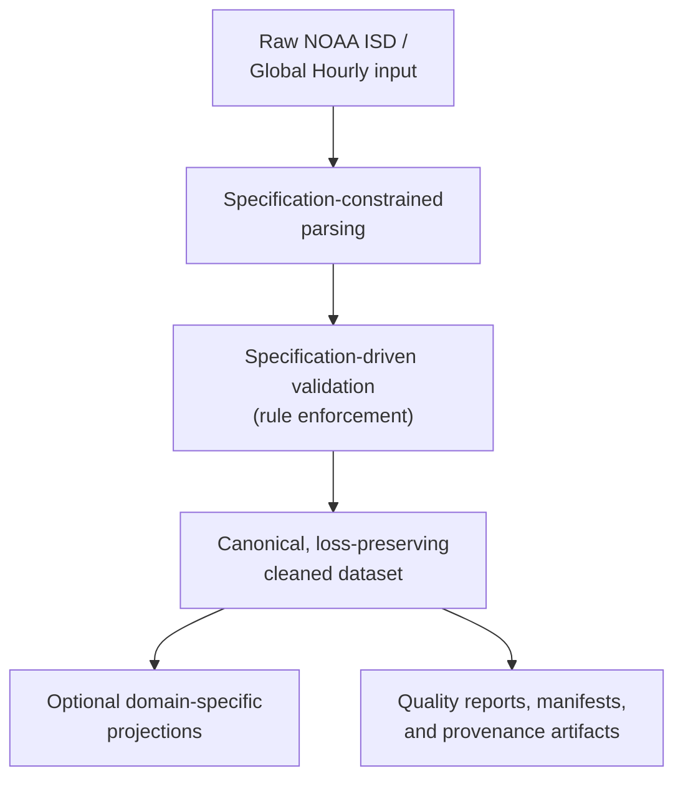

# NOAA-Spec

NOAA-Spec is a deterministic canonicalization layer for NOAA ISD / Global Hourly observations. It turns raw NOAA rows into a specification-constrained canonical CSV with explicit nulls, preserved quality codes, stable column names, and deterministic serialization.

High-level pipeline overview:



NOAA-Spec transforms raw NOAA observations into a canonical cleaned representation governed by specification-derived rules. That canonical dataset is the source layer for optional domain-specific projections and for deterministic downstream artifacts such as quality reports, release manifests, and related provenance records.

## JOSS Scope — Start Here

**The JOSS submission is the `noaa-spec clean` CLI, its canonical output contract, and the bundled checksum-backed reproducibility fixture.** That is the reviewed surface.

| In scope (JOSS-reviewed) | Not in scope |
| --- | --- |
| `src/noaa_spec/` — installable package and CLI | `maintainer/` — internal planning and audit docs |
| `reproducibility/` — tracked fixture and verification | `tools/` — internal spec-coverage tooling |
| `docs/` — output guide and worked example | `spec_sources/` — NOAA format reference copies |
| `paper/` — JOSS manuscript | `scripts/` — operational and batch-run helpers |
| `README.md`, `REPRODUCIBILITY.md` | `noaa_file_index/`, `output/`, `data/` — local data |

**Public API surface.** Within `src/noaa_spec/`, the public surface is:

- `cleaning.py` — canonical interpretation logic
- `constants.py` — field rules, sentinels, and QC definitions
- `deterministic_io.py` — checksummable CSV writer
- `cli.py` — the `noaa-spec clean` entry point
- `domains/` — view definitions for derived projections

Other modules (`pipeline.py`, `cleaning_runner.py`, `internal/`, `research_reports.py`, `noaa_client.py`) support maintainer batch workflows and are not required for normal use or JOSS evaluation.

## Docker First Run

For independent reviewer verification and the cleanest first run, use Docker:

```bash
docker build -f Dockerfile -t noaa-spec-review .
docker run --rm noaa-spec-review bash scripts/verify_reproducibility.sh
```

Expected verification result:

```text
PASS: reproducibility verification succeeded.
SHA256: b48aba1b8a304451dc3874b963d76275bf79ad68c6f28d9190e0e636f2887597
```

This is the recommended reviewer-safe path. It reruns the tracked reproducibility fixture and verifies the canonical contract checksum without depending on a host-local Python setup.

## Optional Local Install

For ordinary local use, install NOAA-Spec into a Python 3.12 environment with `venv` support.

> **Ubuntu/Debian users:** install venv support first if you have not already:
>
> ```bash
> sudo apt install python3-venv
> ```

If local `venv` setup is unavailable, use the Docker path above instead.

```bash
python3 -m venv .venv
source .venv/bin/activate
python3 -m pip install --upgrade pip
python3 -m pip install -e .
noaa-spec clean reproducibility/minimal/station_raw.csv /tmp/station_cleaned.csv
sha256sum /tmp/station_cleaned.csv
```

Expected checksum: `b48aba1b8a304451dc3874b963d76275bf79ad68c6f28d9190e0e636f2887597`

## Run The Canonical Contract

The canonical dataset defines the reproducible interpretation contract. In that public canonical CSV, the station identifier remains `STATION`, matching the bundled fixture and CLI output. Optional `--view` outputs are derived projections for usability and do not modify the underlying contract.

For a first inspection path, many users begin with a smaller derived view:

```bash
noaa-spec clean reproducibility/minimal/station_raw.csv /tmp/station_metadata.csv --view metadata
```

The canonical CSV is the full loss-preserving contract and is intentionally wide. Optional views are usability projections derived from that canonical output, so you can orient yourself quickly and then expand into the full canonical columns as needed.

## Optional Derived Views

Other supported views:

- `metadata`
- `wind`
- `precipitation`
- `clouds_visibility`
- `pressure_temperature`
- `remarks`

The `metadata` view contains station/time context and identifying metadata rather than cleaned meteorological measurements. For compatibility, `core` and `core_meteorology` remain accepted aliases for `metadata`.

## Minimal Workflow

Use the bundled raw NOAA sample in [reproducibility/minimal/station_raw.csv](reproducibility/minimal/station_raw.csv). It is tracked in the repository, so the workflow is runnable without finding outside data first.

Raw snippet:

```text
DATE                 TMP      DEW      VIS
2000-01-10T06:00:00  +0180,1  +0100,1  010000,1,N,1
2000-03-17T09:00:00  +9999,9  +9999,9  999999,9,N,1
```

Canonical subset:

```text
DATE                 temperature_c  temperature_quality_code  dew_point_c  visibility_m  TMP__qc_reason
2000-01-10T06:00:00  18.0           1                         10.0         10000.0       NaN
2000-03-17T09:00:00  NaN            9                         NaN          NaN           SENTINEL_MISSING
```

Key transformations:

- Sentinel-coded values such as `+9999,9` become nulls instead of fake measurements.
- NOAA QC semantics are preserved in separate fields such as `temperature_quality_code`.
- Output columns are normalized into a stable observation-level schema such as `temperature_c`, `dew_point_c`, and `visibility_m`.

## Further Reading

For a column-level explanation of the cleaned output, see [docs/UNDERSTANDING_OUTPUT.md](docs/UNDERSTANDING_OUTPUT.md).
For a worked example showing what a user gains from the canonical layer, see [docs/examples/CANONICAL_WALKTHROUGH.md](docs/examples/CANONICAL_WALKTHROUGH.md).

## Quick Reviewer Inspection

Inspect a small, reviewer-friendly subset from the tracked canonical fixture:

```bash
python3 - <<'PY'
import csv

cols = [
    "STATION",
    "DATE",
    "temperature_c",
    "temperature_quality_code",
    "visibility_m",
    "TMP__qc_reason",
]

with open("reproducibility/minimal/station_cleaned_expected.csv", newline="", encoding="utf-8") as handle:
    reader = csv.DictReader(handle)
    for row in list(reader)[:5]:
        print({col: row[col] for col in cols})
PY
```

## Reproducibility Verification

The tracked fixture is also used for checksum-backed reproducibility verification:

- Raw input: [reproducibility/minimal/station_raw.csv](reproducibility/minimal/station_raw.csv)
- Expected cleaned output: [reproducibility/minimal/station_cleaned_expected.csv](reproducibility/minimal/station_cleaned_expected.csv)
- Expected cleaned SHA256: `b48aba1b8a304451dc3874b963d76275bf79ad68c6f28d9190e0e636f2887597`

The included fixture is intentionally minimal (5 rows) and serves as a deterministic reproducibility proof.

For the complete verification workflow, Docker clean-environment path, and explicit reproducibility boundary, see [REPRODUCIBILITY.md](REPRODUCIBILITY.md).

## Docs

- Reproducibility: [REPRODUCIBILITY.md](REPRODUCIBILITY.md)
- Output guide: [docs/UNDERSTANDING_OUTPUT.md](docs/UNDERSTANDING_OUTPUT.md)
- Worked example: [docs/examples/CANONICAL_WALKTHROUGH.md](docs/examples/CANONICAL_WALKTHROUGH.md)
