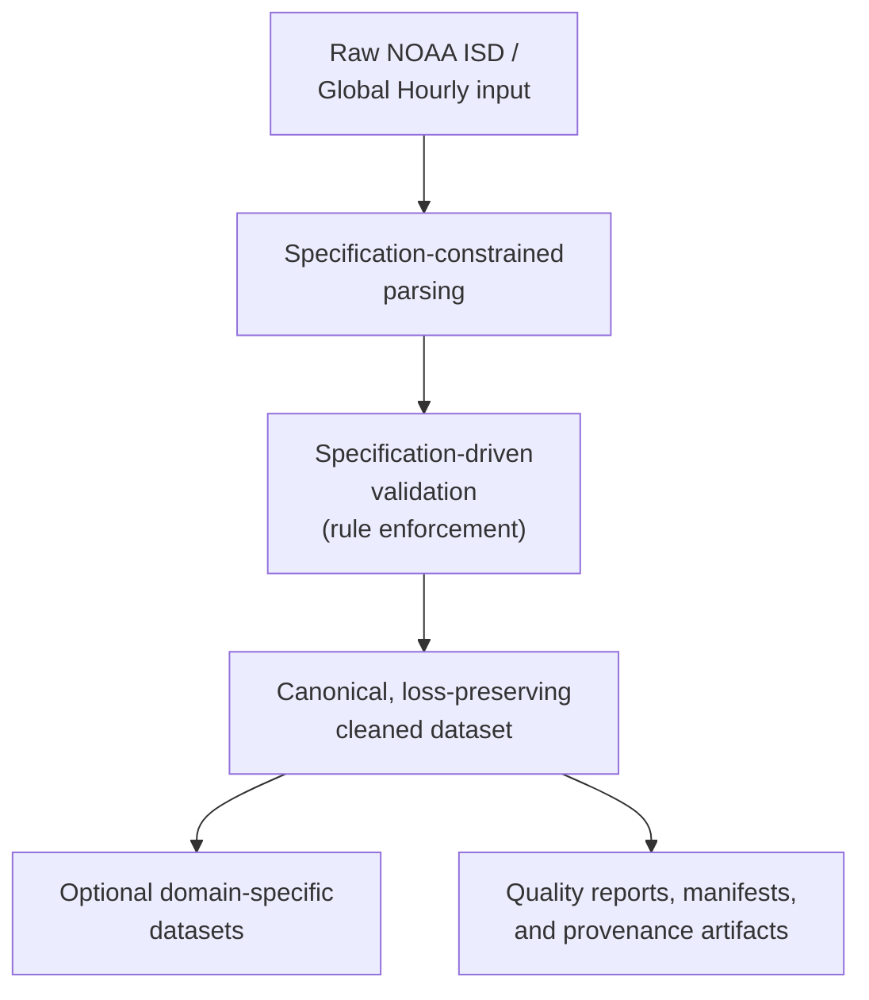

# NOAA-Spec

NOAA-Spec is a deterministic canonicalization layer for NOAA ISD / Global Hourly observations. It turns raw NOAA rows into a specification-constrained canonical CSV with explicit nulls, preserved quality codes, stable column names, and deterministic serialization.

High-level pipeline overview:



NOAA-Spec transforms raw NOAA observations into a canonical cleaned representation governed by specification-derived rules. That canonical dataset is the source layer for optional domain-specific datasets and for deterministic downstream artifacts such as quality reports, release manifests, and related provenance records.

## JOSS Scope — Start Here

**The JOSS submission is the `noaa-spec clean` CLI, its canonical output contract, and the bundled checksum-backed reproducibility fixture.** That is the reviewed surface.

| In scope (JOSS-reviewed) | Not in scope |
| --- | --- |
| `src/noaa_spec/` — installable package and CLI | `maintainer/` — internal planning and audit docs |
| `reproducibility/` — tracked fixture and verification | `tools/` — internal spec-coverage tooling |
| `docs/` — output guide and worked example | `spec_sources/` — NOAA format reference copies |
| `paper/` — JOSS manuscript | `scripts/` — operational and batch-run helpers |
| `README.md`, `REPRODUCIBILITY.md` | `noaa_file_index/`, `output/`, `data/` — local data |

**Public API surface.** Within `src/noaa_spec/`, the public surface is:

- `cleaning.py` — canonical interpretation logic
- `constants.py` — field rules, sentinels, and QC definitions
- `deterministic_io.py` — checksummable CSV writer
- `cli.py` — the `noaa-spec clean` entry point
- `noaa_client.py` — public NOAA Global Hourly download helpers for single-station workflows
- `domains/` — view definitions for domain-specific datasets
- `contracts.py` — schema contract definitions used by the domain publisher

Modules under `internal/` (batch orchestration, pipeline helpers, report generation) are maintainer-oriented, excluded from the installable distribution, and not part of the JOSS-reviewed surface. The [single-station example script](examples/download_and_clean_station.py) is the recommended cross-platform workflow for downloading and cleaning one station.

## Docker First Run

For independent reviewer verification and the cleanest first run, use Docker:

Docker installed and running is required before these commands will work.

```bash
docker --version
```

If this command fails, Docker is not correctly installed or not available on PATH.

```bash
docker build -f Dockerfile -t noaa-spec-review .
docker run --rm noaa-spec-review bash scripts/verify_reproducibility.sh
```

Expected verification result:

```text
PASS: reproducibility verification succeeded.
SHA256: b48aba1b8a304451dc3874b963d76275bf79ad68c6f28d9190e0e636f2887597
```

This is the recommended reviewer-safe path for independent reviewer verification and a clean first run. It reruns the tracked reproducibility fixture and verifies the canonical contract checksum without depending on a host-local Python setup.

## Optional Local Install

> **Requires Python 3.11 or 3.12.** Python 3.13 is not currently supported. If `noaa-spec` is not on PATH after install, use `python -m noaa_spec.cli` as a fallback (see below).

For ordinary local use, install NOAA-Spec into a supported Python environment with `venv` support. This is the normal user/developer workflow, not the independent reviewer verification path.

If local `venv` setup is unavailable or inconvenient, use the Docker path above instead.

The base install is sufficient for cleaning existing local NOAA CSV files with `noaa-spec clean`. Downloading NOAA data also requires the `fetch` optional dependency, which installs `requests`. The base install already includes `pandas` and `pyarrow`.

On any platform, if `pyarrow` does not provide a compatible wheel for the active Python version, `pip` may try to build from source and fail. Use Python 3.11 or 3.12.

### Windows PowerShell

If PowerShell blocks script activation, run this first:

```powershell
Set-ExecutionPolicy -Scope Process -ExecutionPolicy Bypass
```

```powershell
py -3.12 --version
py -3.12 -m venv .venv
.\.venv\Scripts\Activate.ps1
python -m pip install --upgrade pip setuptools wheel
python -m pip install -e .
noaa-spec clean reproducibility/minimal/station_raw.csv $env:TEMP\station_cleaned.csv
Get-FileHash $env:TEMP\station_cleaned.csv -Algorithm SHA256
```

### macOS / Linux

The exact command for the installed Python 3.12 interpreter may vary by system, but `python3.12` is the standard example used here.

```bash
python3.12 --version
python3.12 -m venv .venv
source .venv/bin/activate
python -m pip install --upgrade pip setuptools wheel
python -m pip install -e .
noaa-spec clean reproducibility/minimal/station_raw.csv /tmp/station_cleaned.csv
python -c "import hashlib, pathlib; print(hashlib.sha256(pathlib.Path('/tmp/station_cleaned.csv').read_bytes()).hexdigest())"
```

### Ubuntu / Debian Note

Ubuntu/Debian users may need to install `venv` support first:

```bash
sudo apt install python3-venv
```

Expected checksum: `b48aba1b8a304451dc3874b963d76275bf79ad68c6f28d9190e0e636f2887597`

If `noaa-spec` is not found after install, use the module fallback:

```bash
python -m noaa_spec.cli clean reproducibility/minimal/station_raw.csv /tmp/station_cleaned.csv
```

## Minimal Workflow

Use the bundled raw NOAA sample in [reproducibility/minimal/station_raw.csv](reproducibility/minimal/station_raw.csv). It is tracked in the repository, so the workflow is runnable without finding outside data first.

Raw snippet:

```text
DATE                 TMP      DEW      VIS
2000-01-10T06:00:00  +0180,1  +0100,1  010000,1,N,1
2000-03-17T09:00:00  +9999,9  +9999,9  999999,9,N,1
```

Canonical subset:

```text
DATE                 temperature_c  temperature_quality_code  dew_point_c  visibility_m  TMP__qc_reason
2000-01-10T06:00:00  18.0           1                         10.0         10000.0       NaN
2000-03-17T09:00:00  NaN            9                         NaN          NaN           SENTINEL_MISSING
```

Key transformations:

- Sentinel-coded values such as `+9999,9` become nulls instead of fake measurements.
- NOAA QC semantics are preserved in separate fields such as `temperature_quality_code`.
- Output columns are normalized into a stable observation-level schema such as `temperature_c`, `dew_point_c`, and `visibility_m`.

The canonical CSV is the full loss-preserving contract and is intentionally wide (~130 columns preserving all decoded fields and QC context). For a first inspection path, many users begin with a smaller derived view:

```bash
noaa-spec clean reproducibility/minimal/station_raw.csv /tmp/station_metadata.csv --view metadata
```

## Optional Derived Views

Other supported views:

- `metadata`
- `wind`
- `precipitation`
- `clouds_visibility`
- `pressure_temperature`
- `remarks`

The `metadata` view contains station/time context and identifying metadata rather than cleaned meteorological measurements. For compatibility, `core` and `core_meteorology` remain accepted aliases for `metadata`.

## Further Reading

For a column-level explanation of the cleaned output, see [docs/UNDERSTANDING_OUTPUT.md](docs/UNDERSTANDING_OUTPUT.md).
For a worked example showing what a user gains from the canonical layer, see [docs/examples/CANONICAL_WALKTHROUGH.md](docs/examples/CANONICAL_WALKTHROUGH.md).

## Quick Reviewer Inspection

Inspect a small, reviewer-friendly subset from the tracked canonical fixture:

```bash
python3 - <<'PY'
import csv

cols = [
    "STATION",
    "DATE",
    "temperature_c",
    "temperature_quality_code",
    "visibility_m",
    "TMP__qc_reason",
]

with open("reproducibility/minimal/station_cleaned_expected.csv", newline="", encoding="utf-8") as handle:
    reader = csv.DictReader(handle)
    for row in list(reader)[:5]:
        print({col: row[col] for col in cols})
PY
```

## Reproducibility Verification

The tracked fixture is also used for checksum-backed reproducibility verification:

- Raw input: [reproducibility/minimal/station_raw.csv](reproducibility/minimal/station_raw.csv)
- Expected cleaned output: [reproducibility/minimal/station_cleaned_expected.csv](reproducibility/minimal/station_cleaned_expected.csv)
- Expected cleaned SHA256: `b48aba1b8a304451dc3874b963d76275bf79ad68c6f28d9190e0e636f2887597`

The included fixture is intentionally minimal (5 rows) and serves as a deterministic reproducibility proof.

For the complete verification workflow, Docker clean-environment path, and explicit reproducibility boundary, see [REPRODUCIBILITY.md](REPRODUCIBILITY.md).

## Optional: Download and Clean a New Station

To download and clean a single NOAA Global Hourly station from the network, install with the `fetch` extra and run the bundled example script. This requires network access and is not needed for reproducibility verification.

```bash
python -m pip install -e ".[fetch]"
python examples/download_and_clean_station.py \
  --station 02536099999 \
  --start-year 2000 \
  --end-year 2025 \
  --output-dir output/02536099999
```

Expected outputs: `output/02536099999/Raw.csv` (downloaded NOAA rows) and `output/02536099999/Cleaned.csv` (canonical cleaned output).

## Docs

- Reproducibility: [REPRODUCIBILITY.md](REPRODUCIBILITY.md)
- Output guide: [docs/UNDERSTANDING_OUTPUT.md](docs/UNDERSTANDING_OUTPUT.md)
- Worked example: [docs/examples/CANONICAL_WALKTHROUGH.md](docs/examples/CANONICAL_WALKTHROUGH.md)
